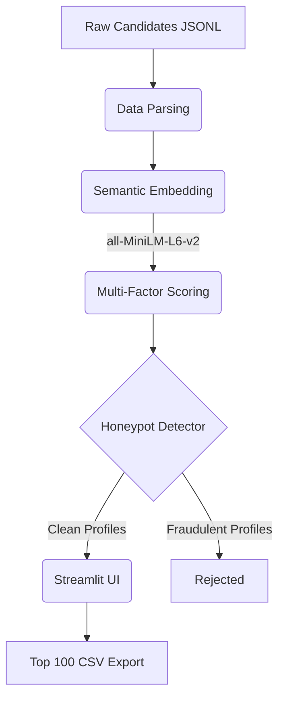

# Redrob AI Candidate Ranking Pipeline

An enterprise-grade candidate ranking system built for the **Redrob AI Hiring Challenge**. This system has been consolidated into a portable, interactive Streamlit application that processes candidate profiles using semantic search and multi-factor scoring to output the top 100 candidates in under 5 minutes on CPU-only hardware.

## 🚀 Architecture Overview

The system is designed as a self-contained, high-performance Streamlit application (`app.py`) that adheres to strict latency and hardware constraints (<16GB RAM, <5 minutes runtime):

1. **Data Parsing**: Streams and parses raw JSON/JSONL candidate data on upload.
2. **Semantic Embedding**: Generates 384-dimensional semantic embeddings using `all-MiniLM-L6-v2`. Embeds **career history and descriptions** (explicitly excluding keyword-stuffed skills lists).
3. **Multi-Factor Scoring Engine**: Executes a rigorous evaluation of candidate signals.
4. **Honeypot Detector**: Filters out fraudulent profiles and keyword-stuffers.
5. **Interactive UI**: Visualizes the top 100 candidates and generates dynamic reasoning strings. Allows CSV export for the final submission.



## 🧠 Scoring Logic (Amended Playbook §1)

The final score is a weighted combination of multiple signals, heavily prioritizing actual career evidence over easily-faked skills lists:

- **Semantic Match (35%)**: JD alignment based on career history embeddings.
- **Career Score (30%)**: Evaluates employer tier (e.g., product vs. consulting) and role relevance.
- **Experience (15%)**: Gaussian-weighted scoring curve peaking around 5–8 years.
- **Location (10%)**: Tier-based geographic proximity scoring.
- **Skills (10%)**: Tiebreaker signal only.
- **Behavioral Multiplier**: A multiplicative layer (0.50x to 1.10x) based on GitHub activity, login recency, notice periods, and recruiter response rates.

## 🛡️ Anti-Fraud Honeypot Detection

The pipeline includes a robust set of countermeasures to disqualify "imposter" profiles:
1. **Rule 1 (Duration Fake)**: Disqualifies candidates claiming "expert" status in AI/ML skills with `< 3 months` of actual usage.
2. **Rule 2 (Non-Technical Mismatch)**: Disqualifies candidates with titles like "Marketing Manager" or "HR" who claim 5+ expert AI skills. Applies a soft-penalty (0.70x) for border cases.
3. **Rule 3 (Timeline Gap)**: Flags candidates whose stated Years of Experience (YOE) drastically exceeds their verifiable career history timeline.

## ⚙️ How to Run

### 1. Setup Environment
```bash
python -m venv .venv
source .venv/Scripts/activate  # (Windows: .venv\Scripts\activate)
pip install -r requirements.txt
```

### 2. Launch the Streamlit App
```bash
streamlit run app.py
```

### 3. Usage
1. Open the local Streamlit URL in your browser.
2. Upload the `candidates.jsonl` or `.json` file through the UI.
3. Wait for the pipeline to complete (progress bar will update).
4. Review the top candidates and download the generated `top100.csv` file.

## 📋 Dependencies
- `streamlit`
- `sentence-transformers`
- `rapidfuzz`
- `pandas`
- `numpy`
- `torch` (CPU only)
